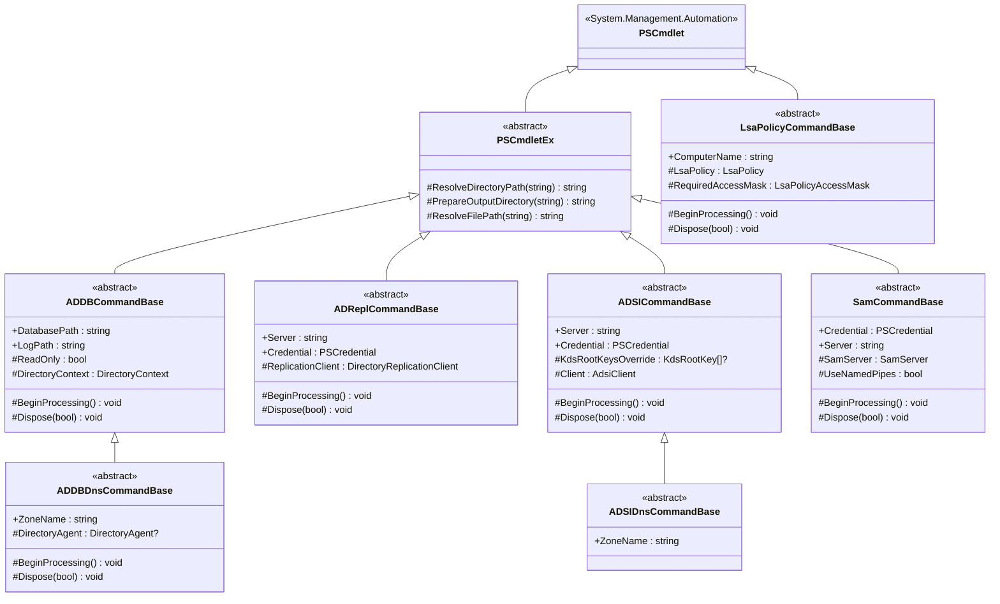
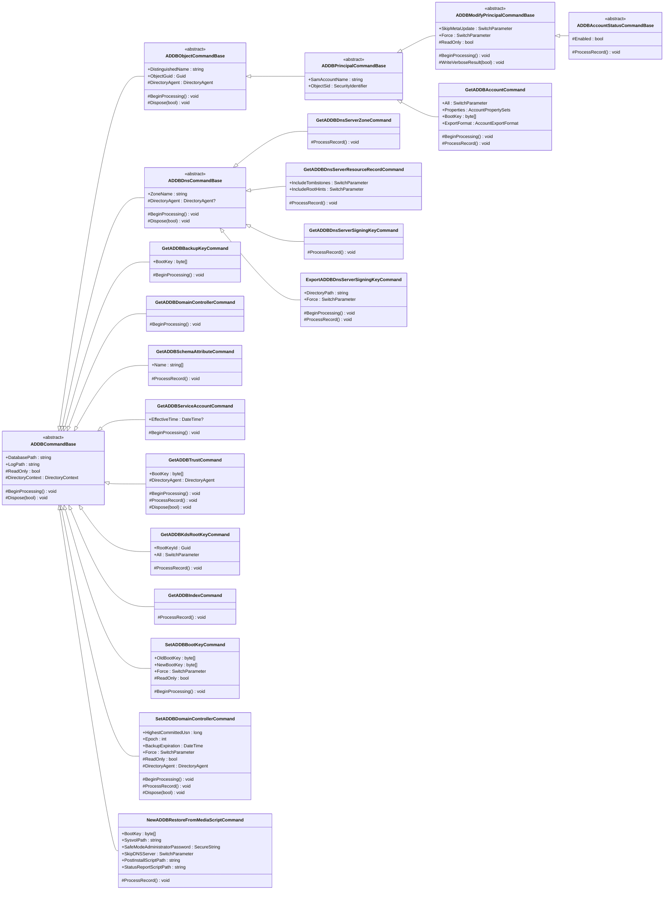
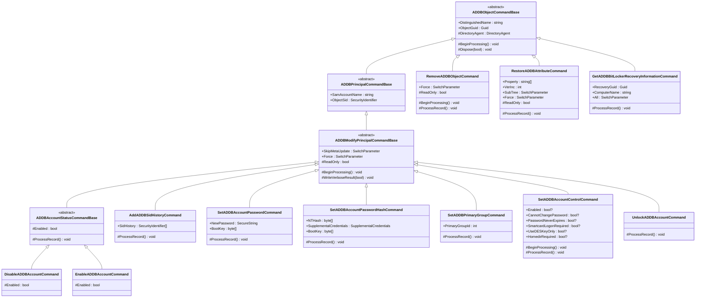
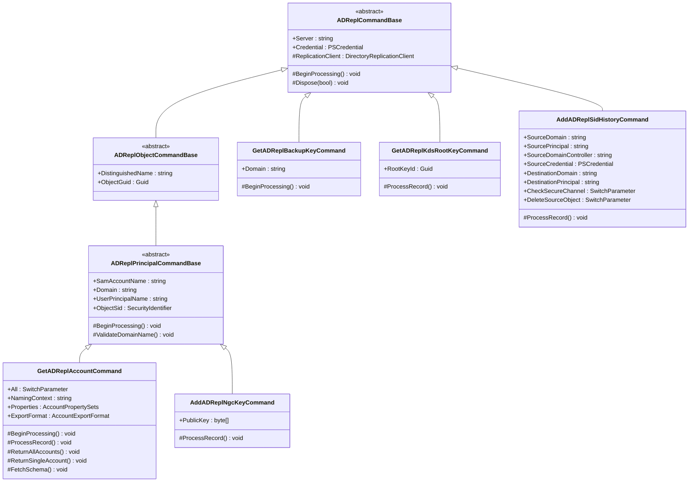
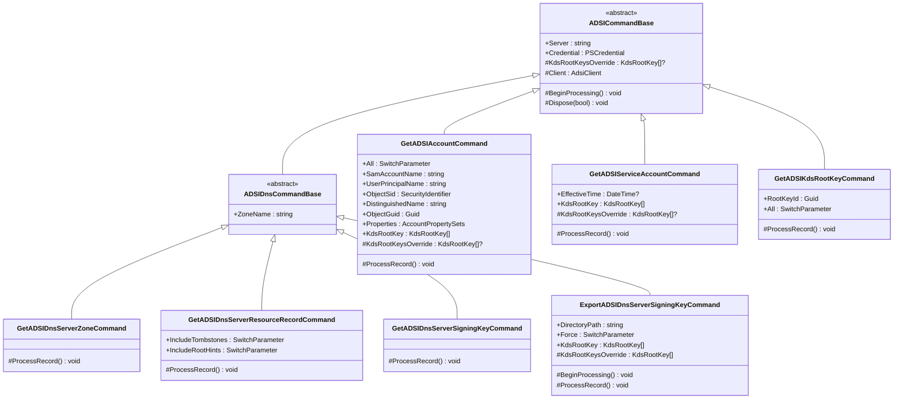
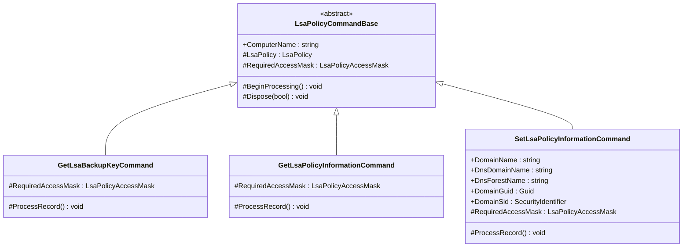
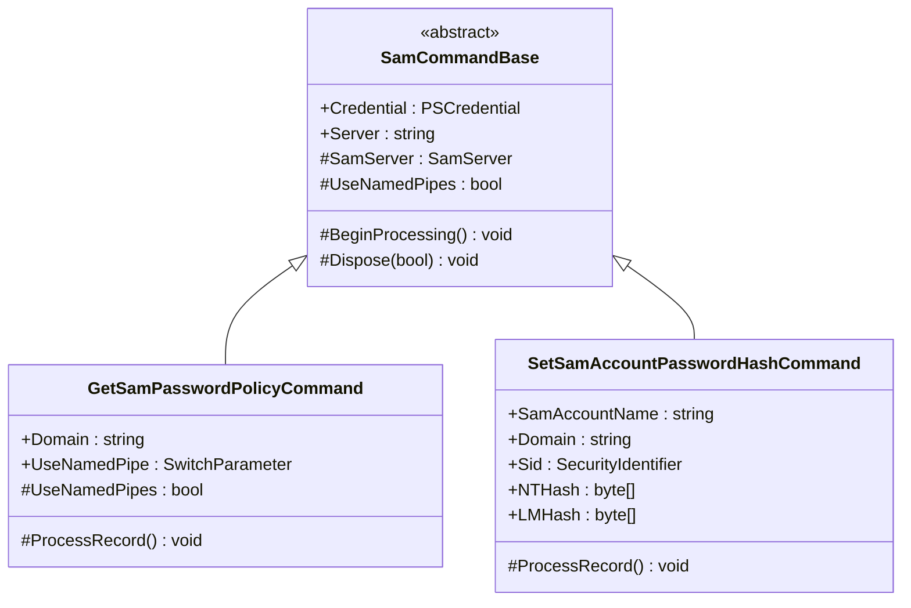
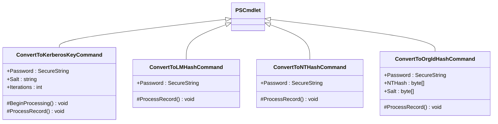
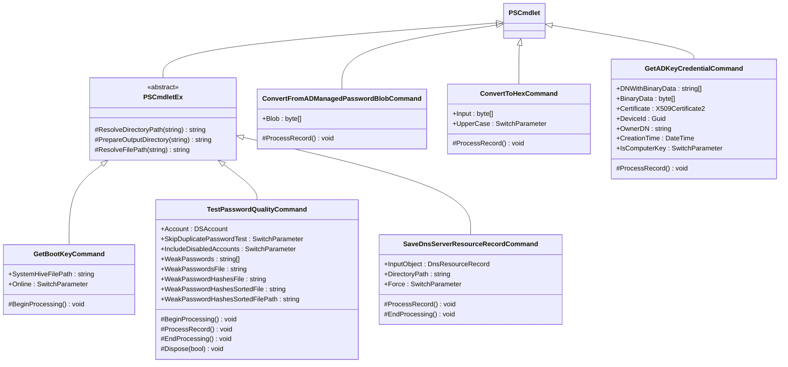

# PowerShell Command Class Inheritance Diagram

## Overview

This document shows the class inheritance hierarchy for all binary PowerShell cmdlets in the DSInternals module.

Each class node lists three groups of members:

1. **Public properties** (`+`) — exposed as PowerShell cmdlet parameters.
2. **Protected properties** (`#`) — internal state shared with derived classes (not surfaced to PowerShell).
3. **Protected methods** (`#name()`) — lifecycle overrides (`BeginProcessing`, `ProcessRecord`, `EndProcessing`, `Dispose`) and helpers.

Mermaid renders properties and methods in separate compartments; the public/protected split inside the property compartment is conveyed by the `+`/`#` prefix.

## Base Class Hierarchy

```mermaid
classDiagram
    direction TB
    class PSCmdlet {
        <<System.Management.Automation>>
    }
    class PSCmdletEx {
        <<abstract>>
        #ResolveDirectoryPath(string) string
        #PrepareOutputDirectory(string) string
        #ResolveFilePath(string) string
    }
    class ADDBCommandBase {
        <<abstract>>
        +DatabasePath : string
        +LogPath : string
        #ReadOnly : bool
        #DirectoryContext : DirectoryContext
        #BeginProcessing() void
        #Dispose(bool) void
    }
    class ADDBDnsCommandBase {
        <<abstract>>
        +ZoneName : string
        #DirectoryAgent : DirectoryAgent?
        #BeginProcessing() void
        #Dispose(bool) void
    }
    class ADReplCommandBase {
        <<abstract>>
        +Server : string
        +Credential : PSCredential
        #ReplicationClient : DirectoryReplicationClient
        #BeginProcessing() void
        #Dispose(bool) void
    }
    class ADSICommandBase {
        <<abstract>>
        +Server : string
        +Credential : PSCredential
        #KdsRootKeysOverride : KdsRootKey[]?
        #Client : AdsiClient
        #BeginProcessing() void
        #Dispose(bool) void
    }
    class ADSIDnsCommandBase {
        <<abstract>>
        +ZoneName : string
    }
    class LsaPolicyCommandBase {
        <<abstract>>
        +ComputerName : string
        #LsaPolicy : LsaPolicy
        #RequiredAccessMask : LsaPolicyAccessMask
        #BeginProcessing() void
        #Dispose(bool) void
    }
    class SamCommandBase {
        <<abstract>>
        +Credential : PSCredential
        +Server : string
        #SamServer : SamServer
        #UseNamedPipes : bool
        #BeginProcessing() void
        #Dispose(bool) void
    }

    PSCmdlet <|-- PSCmdletEx
    PSCmdletEx <|-- ADDBCommandBase
    ADDBCommandBase <|-- ADDBDnsCommandBase
    PSCmdletEx <|-- ADReplCommandBase
    PSCmdletEx <|-- ADSICommandBase
    ADSICommandBase <|-- ADSIDnsCommandBase
    PSCmdlet <|-- LsaPolicyCommandBase
    PSCmdletEx <|-- SamCommandBase
```

## Database Commands (ADDB)

```mermaid
classDiagram
    direction LR
    class ADDBCommandBase {
        <<abstract>>
        +DatabasePath : string
        +LogPath : string
        #ReadOnly : bool
        #DirectoryContext : DirectoryContext
        #BeginProcessing() void
        #Dispose(bool) void
    }
    class ADDBObjectCommandBase {
        <<abstract>>
        +DistinguishedName : string
        +ObjectGuid : Guid
        #DirectoryAgent : DirectoryAgent
        #BeginProcessing() void
        #Dispose(bool) void
    }
    class ADDBPrincipalCommandBase {
        <<abstract>>
        +SamAccountName : string
        +ObjectSid : SecurityIdentifier
    }
    class ADDBModifyPrincipalCommandBase {
        <<abstract>>
        +SkipMetaUpdate : SwitchParameter
        +Force : SwitchParameter
        #ReadOnly : bool
        #BeginProcessing() void
        #WriteVerboseResult(bool) void
    }
    class ADDBAccountStatusCommandBase {
        <<abstract>>
        #Enabled : bool
        #ProcessRecord() void
    }
    class ADDBDnsCommandBase {
        <<abstract>>
        +ZoneName : string
        #DirectoryAgent : DirectoryAgent?
        #BeginProcessing() void
        #Dispose(bool) void
    }

    ADDBCommandBase <|-- ADDBObjectCommandBase
    ADDBObjectCommandBase <|-- ADDBPrincipalCommandBase
    ADDBPrincipalCommandBase <|-- ADDBModifyPrincipalCommandBase
    ADDBModifyPrincipalCommandBase <|-- ADDBAccountStatusCommandBase
    ADDBCommandBase <|-- ADDBDnsCommandBase

    class GetADDBAccountCommand {
        +All : SwitchParameter
        +Properties : AccountPropertySets
        +BootKey : byte[]
        +ExportFormat : AccountExportFormat
        #BeginProcessing() void
        #ProcessRecord() void
    }
    class GetADDBBackupKeyCommand {
        +BootKey : byte[]
        #BeginProcessing() void
    }
    class GetADDBDomainControllerCommand {
        #BeginProcessing() void
    }
    class GetADDBSchemaAttributeCommand {
        +Name : string[]
        #ProcessRecord() void
    }
    class GetADDBServiceAccountCommand {
        +EffectiveTime : DateTime?
        #BeginProcessing() void
    }
    class GetADDBTrustCommand {
        +BootKey : byte[]
        #DirectoryAgent : DirectoryAgent
        #BeginProcessing() void
        #ProcessRecord() void
        #Dispose(bool) void
    }
    class GetADDBKdsRootKeyCommand {
        +RootKeyId : Guid
        +All : SwitchParameter
        #ProcessRecord() void
    }
    class GetADDBDnsServerZoneCommand {
        #ProcessRecord() void
    }
    class GetADDBDnsServerResourceRecordCommand {
        +IncludeTombstones : SwitchParameter
        +IncludeRootHints : SwitchParameter
        #ProcessRecord() void
    }
    class GetADDBDnsServerSigningKeyCommand {
        #ProcessRecord() void
    }
    class ExportADDBDnsServerSigningKeyCommand {
        +DirectoryPath : string
        +Force : SwitchParameter
        #BeginProcessing() void
        #ProcessRecord() void
    }
    class GetADDBIndexCommand {
        #ProcessRecord() void
    }
    class SetADDBBootKeyCommand {
        +OldBootKey : byte[]
        +NewBootKey : byte[]
        +Force : SwitchParameter
        #ReadOnly : bool
        #BeginProcessing() void
    }
    class SetADDBDomainControllerCommand {
        +HighestCommittedUsn : long
        +Epoch : int
        +BackupExpiration : DateTime
        +Force : SwitchParameter
        #ReadOnly : bool
        #DirectoryAgent : DirectoryAgent
        #BeginProcessing() void
        #ProcessRecord() void
        #Dispose(bool) void
    }
    class NewADDBRestoreFromMediaScriptCommand {
        +BootKey : byte[]
        +SysvolPath : string
        +SafeModeAdministratorPassword : SecureString
        +SkipDNSServer : SwitchParameter
        +PostInstallScriptPath : string
        +StatusReportScriptPath : string
        #ProcessRecord() void
    }

    ADDBCommandBase <|-- GetADDBBackupKeyCommand
    ADDBCommandBase <|-- GetADDBDomainControllerCommand
    ADDBCommandBase <|-- GetADDBSchemaAttributeCommand
    ADDBCommandBase <|-- GetADDBServiceAccountCommand
    ADDBCommandBase <|-- GetADDBTrustCommand
    ADDBCommandBase <|-- GetADDBKdsRootKeyCommand
    ADDBDnsCommandBase <|-- GetADDBDnsServerZoneCommand
    ADDBDnsCommandBase <|-- GetADDBDnsServerResourceRecordCommand
    ADDBDnsCommandBase <|-- GetADDBDnsServerSigningKeyCommand
    ADDBDnsCommandBase <|-- ExportADDBDnsServerSigningKeyCommand
    ADDBCommandBase <|-- GetADDBIndexCommand
    ADDBCommandBase <|-- SetADDBBootKeyCommand
    ADDBCommandBase <|-- SetADDBDomainControllerCommand
    ADDBCommandBase <|-- NewADDBRestoreFromMediaScriptCommand
    ADDBPrincipalCommandBase <|-- GetADDBAccountCommand
```

## Database Object/Principal Commands

```mermaid
classDiagram
    direction TB
    class ADDBObjectCommandBase {
        <<abstract>>
        +DistinguishedName : string
        +ObjectGuid : Guid
        #DirectoryAgent : DirectoryAgent
        #BeginProcessing() void
        #Dispose(bool) void
    }
    class ADDBPrincipalCommandBase {
        <<abstract>>
        +SamAccountName : string
        +ObjectSid : SecurityIdentifier
    }
    class ADDBModifyPrincipalCommandBase {
        <<abstract>>
        +SkipMetaUpdate : SwitchParameter
        +Force : SwitchParameter
        #ReadOnly : bool
        #BeginProcessing() void
        #WriteVerboseResult(bool) void
    }
    class ADDBAccountStatusCommandBase {
        <<abstract>>
        #Enabled : bool
        #ProcessRecord() void
    }

    ADDBObjectCommandBase <|-- ADDBPrincipalCommandBase
    ADDBPrincipalCommandBase <|-- ADDBModifyPrincipalCommandBase
    ADDBModifyPrincipalCommandBase <|-- ADDBAccountStatusCommandBase

    class RemoveADDBObjectCommand {
        +Force : SwitchParameter
        #ReadOnly : bool
        #BeginProcessing() void
        #ProcessRecord() void
    }
    class RestoreADDBAttributeCommand {
        +Property : string[]
        +VerInc : int
        +SubTree : SwitchParameter
        +Force : SwitchParameter
        #ReadOnly : bool
        #ProcessRecord() void
    }
    class GetADDBBitLockerRecoveryInformationCommand {
        +RecoveryGuid : Guid
        +ComputerName : string
        +All : SwitchParameter
        #ProcessRecord() void
    }
    class DisableADDBAccountCommand {
        #Enabled : bool
    }
    class EnableADDBAccountCommand {
        #Enabled : bool
    }
    class AddADDBSidHistoryCommand {
        +SidHistory : SecurityIdentifier[]
        #ProcessRecord() void
    }
    class SetADDBAccountPasswordCommand {
        +NewPassword : SecureString
        +BootKey : byte[]
        #ProcessRecord() void
    }
    class SetADDBAccountPasswordHashCommand {
        +NTHash : byte[]
        +SupplementalCredentials : SupplementalCredentials
        +BootKey : byte[]
        #ProcessRecord() void
    }
    class SetADDBPrimaryGroupCommand {
        +PrimaryGroupId : int
        #ProcessRecord() void
    }
    class SetADDBAccountControlCommand {
        +Enabled : bool?
        +CannotChangePassword : bool?
        +PasswordNeverExpires : bool?
        +SmartcardLogonRequired : bool?
        +UseDESKeyOnly : bool?
        +HomedirRequired : bool?
        #BeginProcessing() void
        #ProcessRecord() void
    }
    class UnlockADDBAccountCommand {
        #ProcessRecord() void
    }

    ADDBObjectCommandBase <|-- RemoveADDBObjectCommand
    ADDBObjectCommandBase <|-- RestoreADDBAttributeCommand
    ADDBObjectCommandBase <|-- GetADDBBitLockerRecoveryInformationCommand
    ADDBAccountStatusCommandBase <|-- DisableADDBAccountCommand
    ADDBAccountStatusCommandBase <|-- EnableADDBAccountCommand
    ADDBModifyPrincipalCommandBase <|-- AddADDBSidHistoryCommand
    ADDBModifyPrincipalCommandBase <|-- SetADDBAccountPasswordCommand
    ADDBModifyPrincipalCommandBase <|-- SetADDBAccountPasswordHashCommand
    ADDBModifyPrincipalCommandBase <|-- SetADDBPrimaryGroupCommand
    ADDBModifyPrincipalCommandBase <|-- SetADDBAccountControlCommand
    ADDBModifyPrincipalCommandBase <|-- UnlockADDBAccountCommand
```

## Replication Commands (ADRepl)

```mermaid
classDiagram
    direction TB
    class ADReplCommandBase {
        <<abstract>>
        +Server : string
        +Credential : PSCredential
        #ReplicationClient : DirectoryReplicationClient
        #BeginProcessing() void
        #Dispose(bool) void
    }
    class ADReplObjectCommandBase {
        <<abstract>>
        +DistinguishedName : string
        +ObjectGuid : Guid
    }
    class ADReplPrincipalCommandBase {
        <<abstract>>
        +SamAccountName : string
        +Domain : string
        +UserPrincipalName : string
        +ObjectSid : SecurityIdentifier
        #BeginProcessing() void
        #ValidateDomainName() void
    }

    ADReplCommandBase <|-- ADReplObjectCommandBase
    ADReplObjectCommandBase <|-- ADReplPrincipalCommandBase

    class GetADReplAccountCommand {
        +All : SwitchParameter
        +NamingContext : string
        +Properties : AccountPropertySets
        +ExportFormat : AccountExportFormat
        #BeginProcessing() void
        #ProcessRecord() void
        #ReturnAllAccounts() void
        #ReturnSingleAccount() void
        #FetchSchema() void
    }
    class GetADReplBackupKeyCommand {
        +Domain : string
        #BeginProcessing() void
    }
    class AddADReplNgcKeyCommand {
        +PublicKey : byte[]
        #ProcessRecord() void
    }
    class GetADReplKdsRootKeyCommand {
        +RootKeyId : Guid
        #ProcessRecord() void
    }
    class AddADReplSidHistoryCommand {
        +SourceDomain : string
        +SourcePrincipal : string
        +SourceDomainController : string
        +SourceCredential : PSCredential
        +DestinationDomain : string
        +DestinationPrincipal : string
        +CheckSecureChannel : SwitchParameter
        +DeleteSourceObject : SwitchParameter
        #ProcessRecord() void
    }

    ADReplPrincipalCommandBase <|-- GetADReplAccountCommand
    ADReplPrincipalCommandBase <|-- AddADReplNgcKeyCommand
    ADReplCommandBase <|-- GetADReplBackupKeyCommand
    ADReplCommandBase <|-- GetADReplKdsRootKeyCommand
    ADReplCommandBase <|-- AddADReplSidHistoryCommand
```

## ADSI Commands

```mermaid
classDiagram
    direction TB
    class ADSICommandBase {
        <<abstract>>
        +Server : string
        +Credential : PSCredential
        #KdsRootKeysOverride : KdsRootKey[]?
        #Client : AdsiClient
        #BeginProcessing() void
        #Dispose(bool) void
    }
    class ADSIDnsCommandBase {
        <<abstract>>
        +ZoneName : string
    }
    class GetADSIAccountCommand {
        +All : SwitchParameter
        +SamAccountName : string
        +UserPrincipalName : string
        +ObjectSid : SecurityIdentifier
        +DistinguishedName : string
        +ObjectGuid : Guid
        +Properties : AccountPropertySets
        +KdsRootKey : KdsRootKey[]
        #KdsRootKeysOverride : KdsRootKey[]?
        #ProcessRecord() void
    }
    class GetADSIServiceAccountCommand {
        +EffectiveTime : DateTime?
        +KdsRootKey : KdsRootKey[]
        #KdsRootKeysOverride : KdsRootKey[]?
        #ProcessRecord() void
    }
    class GetADSIKdsRootKeyCommand {
        +RootKeyId : Guid
        +All : SwitchParameter
        #ProcessRecord() void
    }
    class GetADSIDnsServerZoneCommand {
        #ProcessRecord() void
    }
    class GetADSIDnsServerResourceRecordCommand {
        +IncludeTombstones : SwitchParameter
        +IncludeRootHints : SwitchParameter
        #ProcessRecord() void
    }
    class GetADSIDnsServerSigningKeyCommand {
        #ProcessRecord() void
    }
    class ExportADSIDnsServerSigningKeyCommand {
        +DirectoryPath : string
        +Force : SwitchParameter
        +KdsRootKey : KdsRootKey[]
        #KdsRootKeysOverride : KdsRootKey[]
        #BeginProcessing() void
        #ProcessRecord() void
    }

    ADSICommandBase <|-- ADSIDnsCommandBase
    ADSICommandBase <|-- GetADSIAccountCommand
    ADSICommandBase <|-- GetADSIServiceAccountCommand
    ADSICommandBase <|-- GetADSIKdsRootKeyCommand
    ADSIDnsCommandBase <|-- GetADSIDnsServerZoneCommand
    ADSIDnsCommandBase <|-- GetADSIDnsServerResourceRecordCommand
    ADSIDnsCommandBase <|-- GetADSIDnsServerSigningKeyCommand
    ADSIDnsCommandBase <|-- ExportADSIDnsServerSigningKeyCommand
```

## LSA Commands

```mermaid
classDiagram
    direction TB
    class LsaPolicyCommandBase {
        <<abstract>>
        +ComputerName : string
        #LsaPolicy : LsaPolicy
        #RequiredAccessMask : LsaPolicyAccessMask
        #BeginProcessing() void
        #Dispose(bool) void
    }
    class GetLsaBackupKeyCommand {
        #RequiredAccessMask : LsaPolicyAccessMask
        #ProcessRecord() void
    }
    class GetLsaPolicyInformationCommand {
        #RequiredAccessMask : LsaPolicyAccessMask
        #ProcessRecord() void
    }
    class SetLsaPolicyInformationCommand {
        +DomainName : string
        +DnsDomainName : string
        +DnsForestName : string
        +DomainGuid : Guid
        +DomainSid : SecurityIdentifier
        #RequiredAccessMask : LsaPolicyAccessMask
        #ProcessRecord() void
    }
    LsaPolicyCommandBase <|-- GetLsaBackupKeyCommand
    LsaPolicyCommandBase <|-- GetLsaPolicyInformationCommand
    LsaPolicyCommandBase <|-- SetLsaPolicyInformationCommand
```

## SAM Commands

```mermaid
classDiagram
    direction TB
    class SamCommandBase {
        <<abstract>>
        +Credential : PSCredential
        +Server : string
        #SamServer : SamServer
        #UseNamedPipes : bool
        #BeginProcessing() void
        #Dispose(bool) void
    }
    class GetSamPasswordPolicyCommand {
        +Domain : string
        +UseNamedPipe : SwitchParameter
        #UseNamedPipes : bool
        #ProcessRecord() void
    }
    class SetSamAccountPasswordHashCommand {
        +SamAccountName : string
        +Domain : string
        +Sid : SecurityIdentifier
        +NTHash : byte[]
        +LMHash : byte[]
        #ProcessRecord() void
    }
    SamCommandBase <|-- GetSamPasswordPolicyCommand
    SamCommandBase <|-- SetSamAccountPasswordHashCommand
```

## Hash Commands

```mermaid
classDiagram
    direction TB
    class PSCmdlet

    class ConvertToKerberosKeyCommand {
        +Password : SecureString
        +Salt : string
        +Iterations : int
        #BeginProcessing() void
        #ProcessRecord() void
    }
    class ConvertToLMHashCommand {
        +Password : SecureString
        #ProcessRecord() void
    }
    class ConvertToNTHashCommand {
        +Password : SecureString
        #ProcessRecord() void
    }
    class ConvertToOrgIdHashCommand {
        +Password : SecureString
        +NTHash : byte[]
        +Salt : byte[]
        #ProcessRecord() void
    }

    PSCmdlet <|-- ConvertToKerberosKeyCommand
    PSCmdlet <|-- ConvertToLMHashCommand
    PSCmdlet <|-- ConvertToNTHashCommand
    PSCmdlet <|-- ConvertToOrgIdHashCommand
```

## Encryption Commands

```mermaid
classDiagram
    direction TB
    class PSCmdlet
    class PSCmdletEx {
        <<abstract>>
        #ResolveDirectoryPath(string) string
        #PrepareOutputDirectory(string) string
        #ResolveFilePath(string) string
    }

    PSCmdlet <|-- PSCmdletEx

    class ConvertFromGPPrefPasswordCommand {
        +EncryptedPassword : string
        #ProcessRecord() void
    }
    class ConvertToGPPrefPasswordCommand {
        +Password : SecureString
        #ProcessRecord() void
    }
    class ConvertFromUnicodePasswordCommand {
        +UnicodePassword : string
        #BeginProcessing() void
    }
    class ConvertToUnicodePasswordCommand {
        +Password : SecureString
        +IsUnattendPassword : SwitchParameter
        #BeginProcessing() void
    }
    class NewDpapiNgNamedDescriptorCommand {
        +Name : string
        +Descriptor : string
        +Machine : SwitchParameter
        #ProcessRecord() void
    }
    class GetDpapiNgNamedDescriptorCommand {
        +Name : string
        +Machine : SwitchParameter
        #ProcessRecord() void
    }
    class RemoveDpapiNgNamedDescriptorCommand {
        +Name : string
        +Machine : SwitchParameter
        #ProcessRecord() void
    }
    class ProtectDpapiNgDataCommand {
        +Descriptor : string
        +NamedDescriptor : string
        +Machine : SwitchParameter
        +Cleartext : string
        +Encoding : Encoding
        #ProcessRecord() void
    }
    class UnprotectDpapiNgDataCommand {
        +Blob : byte[]
        +KdsRootKey : KdsRootKey[]
        +Encoding : Encoding
        #ProcessRecord() void
    }
    class GetDpapiNgDataCommand {
        +Blob : byte[]
        #ProcessRecord() void
    }
    class GetDpapiNgSidKeyIdentifierCommand {
        +Blob : byte[]
        #ProcessRecord() void
    }
    class SaveDpapiNgSidKeyCommand {
        +Identifier : ProtectionKeyIdentifier
        +IdentifierBlob : byte[]
        +KdsRootKey : KdsRootKey[]
        +SecurityIdentifier : SecurityIdentifier
        #ProcessRecord() void
    }
    class ClearDpapiNgSidKeyCacheCommand {
        #ProcessRecord() void
    }
    class GetDpapiNgPfxCertificateCommand {
        +Path : string
        #ProcessRecord() void
    }
    class UnprotectDpapiNgPfxCertificateCommand {
        +Path : string
        +InputObject : PfxProtectedPassword
        +KdsRootKey : KdsRootKey[]
        #ProcessRecord() void
    }
    class SaveDpapiBlobCommand {
        +DPAPIObject : DPAPIObject
        +Account : DSAccount
        +DirectoryPath : string
        #BeginProcessing() void
        #ProcessRecord() void
    }

    PSCmdlet <|-- ConvertFromGPPrefPasswordCommand
    PSCmdlet <|-- ConvertToGPPrefPasswordCommand
    PSCmdlet <|-- ConvertFromUnicodePasswordCommand
    PSCmdlet <|-- ConvertToUnicodePasswordCommand
    PSCmdlet <|-- NewDpapiNgNamedDescriptorCommand
    PSCmdlet <|-- GetDpapiNgNamedDescriptorCommand
    PSCmdlet <|-- RemoveDpapiNgNamedDescriptorCommand
    PSCmdlet <|-- ProtectDpapiNgDataCommand
    PSCmdlet <|-- UnprotectDpapiNgDataCommand
    PSCmdlet <|-- GetDpapiNgDataCommand
    PSCmdlet <|-- GetDpapiNgSidKeyIdentifierCommand
    PSCmdlet <|-- SaveDpapiNgSidKeyCommand
    PSCmdlet <|-- ClearDpapiNgSidKeyCacheCommand
    PSCmdletEx <|-- GetDpapiNgPfxCertificateCommand
    PSCmdletEx <|-- UnprotectDpapiNgPfxCertificateCommand
    PSCmdletEx <|-- SaveDpapiBlobCommand
```

## Misc Commands

```mermaid
classDiagram
    direction TB
    class PSCmdlet
    class PSCmdletEx {
        <<abstract>>
        #ResolveDirectoryPath(string) string
        #PrepareOutputDirectory(string) string
        #ResolveFilePath(string) string
    }

    PSCmdlet <|-- PSCmdletEx

    class GetBootKeyCommand {
        +SystemHiveFilePath : string
        +Online : SwitchParameter
        #BeginProcessing() void
    }
    class TestPasswordQualityCommand {
        +Account : DSAccount
        +SkipDuplicatePasswordTest : SwitchParameter
        +IncludeDisabledAccounts : SwitchParameter
        +WeakPasswords : string[]
        +WeakPasswordsFile : string
        +WeakPasswordHashesFile : string
        +WeakPasswordHashesSortedFile : string
        +WeakPasswordHashesSortedFilePath : string
        #BeginProcessing() void
        #ProcessRecord() void
        #EndProcessing() void
        #Dispose(bool) void
    }
    class SaveDnsServerResourceRecordCommand {
        +InputObject : DnsResourceRecord
        +DirectoryPath : string
        +Force : SwitchParameter
        #ProcessRecord() void
        #EndProcessing() void
    }
    class ConvertFromADManagedPasswordBlobCommand {
        +Blob : byte[]
        #ProcessRecord() void
    }
    class ConvertToHexCommand {
        +Input : byte[]
        +UpperCase : SwitchParameter
        #ProcessRecord() void
    }
    class GetADKeyCredentialCommand {
        +DNWithBinaryData : string[]
        +BinaryData : byte[]
        +Certificate : X509Certificate2
        +DeviceId : Guid
        +OwnerDN : string
        +CreationTime : DateTime
        +IsComputerKey : SwitchParameter
        #ProcessRecord() void
    }

    PSCmdletEx <|-- GetBootKeyCommand
    PSCmdletEx <|-- TestPasswordQualityCommand
    PSCmdletEx <|-- SaveDnsServerResourceRecordCommand
    PSCmdlet <|-- ConvertFromADManagedPasswordBlobCommand
    PSCmdlet <|-- ConvertToHexCommand
    PSCmdlet <|-- GetADKeyCredentialCommand
```

## Legend

- **Abstract classes** are marked with `<<abstract>>` and serve as base classes.
- Visibility prefixes follow UML convention: `+` public, `#` protected.
- The first compartment of each class lists properties — public ones (`+`) are PowerShell cmdlet parameters, protected ones (`#`) are internal state used by derived classes.
- The second compartment lists protected methods (cmdlet-lifecycle overrides such as `BeginProcessing`, `ProcessRecord`, `EndProcessing`, `Dispose`, and helpers).
- Inheritance flows from top to bottom (parent → child).

## Command Categories

| Category | Base Class | Description |
|----------|------------|-------------|
| Database | `ADDBCommandBase` | Offline ntds.dit database operations |
| Database DNS | `ADDBDnsCommandBase` | Offline ntds.dit DNS zone, record, and DNSSEC signing-key operations |
| Replication | `ADReplCommandBase` | DCSync/DRS replication protocol operations |
| ADSI | `ADSICommandBase` | LDAP-based operations via ADSI |
| ADSI DNS | `ADSIDnsCommandBase` | Live DNS zone, record, and DNSSEC signing-key operations over ADSI |
| LSA | `LsaPolicyCommandBase` | Local Security Authority operations |
| SAM | `SamCommandBase` | Security Accounts Manager operations |
| Hash | `PSCmdlet` | Password-to-hash conversion utilities |
| Encryption | `PSCmdlet`/`PSCmdletEx` | DPAPI-NG, group-policy preference, and unattend password protection |
| Misc | `PSCmdlet`/`PSCmdletEx` | Standalone utilities (boot key, password quality, key credentials, hex encoding) |
