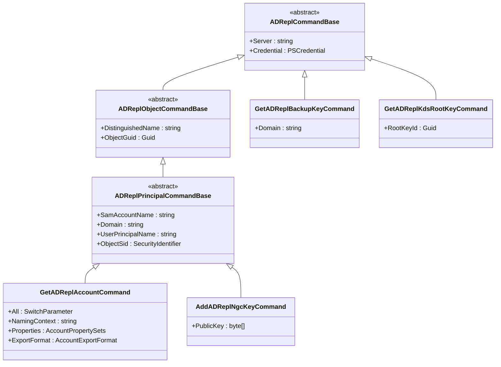

# PowerShell Command Class Inheritance Diagram

## Overview

This document shows the class inheritance hierarchy for all binary PowerShell cmdlets in the DSInternals module.

## Base Class Hierarchy

## Database Commands (ADDB)

## Database Object/Principal Commands

## Replication Commands (ADRepl)

## ADSI, Azure AD, LSA, and SAM Commands

## Standalone Commands

## Legend

- **Abstract classes** are marked with `<<abstract>>` and serve as base classes
- **Properties** shown are PowerShell parameters and switches
- Inheritance flows from top to bottom (parent → child)

## Command Categories

| Category | Base Class | Description |
|----------|------------|-------------|
| Database | `ADDBCommandBase` | Offline ntds.dit database operations |
| Replication | `ADReplCommandBase` | DCSync/DRS replication protocol operations |
| ADSI | `ADSICommandBase` | LDAP-based operations via ADSI |
| Azure AD | `AzureADCommandBase` | Azure Active Directory operations |
| LSA | `LsaPolicyCommandBase` | Local Security Authority operations |
| SAM | `SamCommandBase` | Security Accounts Manager operations |
| Standalone | `PSCmdlet`/`PSCmdletEx` | Utility commands without specialized base |
